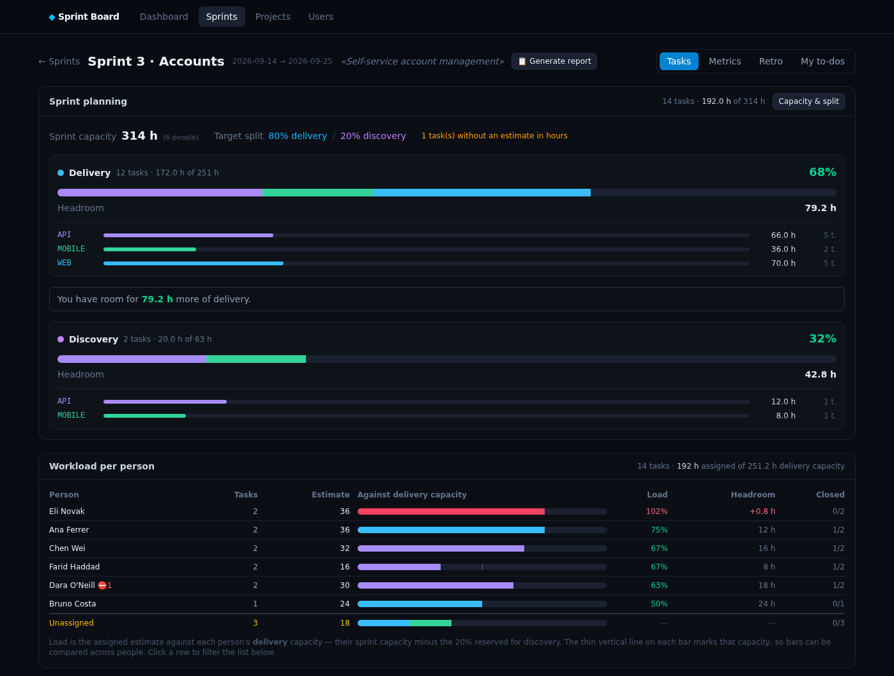
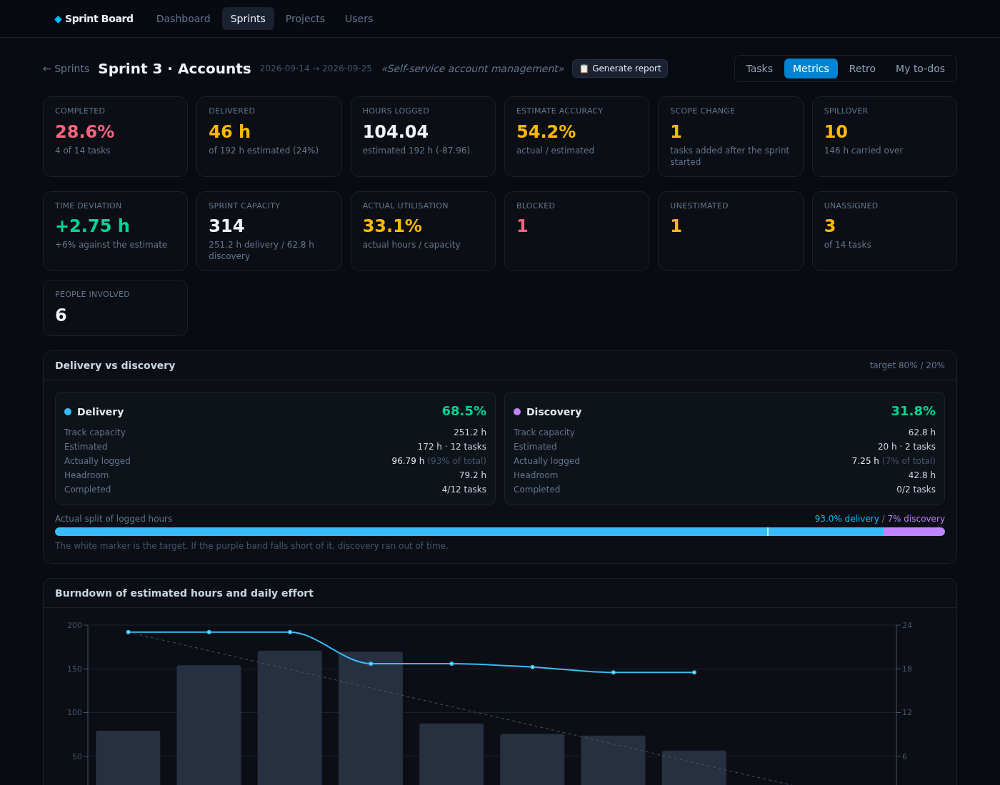
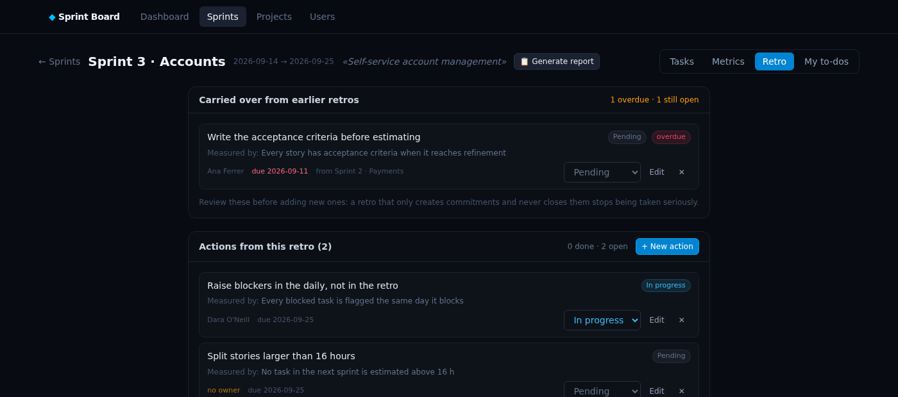

# Sprint Board

A self-hosted board for running a sprint as **Scrum Master**: capacity per person, tasks with
per-person time logging, Jira CSV import, and the metrics you need to tell the team what actually
happened — and to decide what to commit to next.

It is not a Jira replacement. Jira holds the tickets; this holds the part Jira is bad at: how many
hours each person really has this sprint, where those hours went, and whether the plan was
realistic.



## Why it exists

Running a sprint as Scrum Master means answering questions a ticket tracker does not answer:

- **How much can we actually commit to?** Not story points in the abstract — hours, after taking
  out holidays, ceremonies and the share of the sprint reserved for discovery.
- **Is the load spread sensibly?** Not «everyone has tasks», but *this* person is at 102 % of their
  capacity while *that* one is at 50 %.
- **Where did the time really go?** Estimated against logged, per person, per project, per day.
- **What do I say in the retro?** Backed by numbers, not by how the fortnight felt.

Everything runs on your machine, against your own PostgreSQL. No account, no SaaS, no data leaving
the laptop.

## Try it in one command

```bash
make demo
```

That starts a **separate instance** on http://localhost:5190 with an invented team, three sprints
and one of them in flight, so you can click around a board that is already full. It has its own
database, so it cannot touch anything you have.

When you are done: `make demo-down`.

## Running it for real

```bash
make up
```

- Web → http://localhost:5180
- API → http://localhost:5181/api/health
- DB  → `postgres://agile@localhost:5433/agile`

That is the only command you need. It rebuilds whatever changed and **keeps your data**: it lives
in the `agile_pgdata` Docker volume, which survives `make up`, `make down` and machine restarts.

You start with an empty board — create your projects, your people and your first sprint from the
interface.

| Command | What it does |
| --- | --- |
| `make up` | Builds and starts everything. Keeps data. |
| `make down` | Stops the containers. Does **not** delete data. |
| `make demo` | Separate instance with sample data on port 5190. |
| `make demo-down` | Stops the demo and deletes **only** its data. |
| `make logs` | Follows the logs. |
| `make psql` | Opens a SQL console against the database. |
| `make backup` | Dumps the DB to `backups/agile-<date>.sql`. |
| `make restore FILE=backups/…sql` | Restores a dump. |
| `make reset` | **Destructive.** Wipes the volume and starts from scratch (asks for confirmation). |

Ports and credentials are configurable: copy `.env.example` to `.env` and edit it. `backups/` is
git-ignored, because a dump contains real names and ticket keys.

**Requirements:** Docker with Compose v2, and `make`. Nothing else — Node is only needed if you
want to run the services outside Docker.

## What you get

**Planning.** Capacity per person *per sprint* (not a fixed number — someone on holiday has fewer
hours this fortnight), an explicit delivery/discovery split, and a running total of committed
estimate against real capacity while you add tasks.

**Tracking.** Log time per person and date, on any task. Statuses follow a real flow
(`TO DO → IN PROGRESS → PEER REVIEW → READY FOR EPHEMERAL → READY FOR ACC → UAT → DONE`), with
*blocked* as a separate flag rather than a status.

**Jira import.** Paste in the worklog CSV and the issues CSV. The importer resolves subtask
worklogs onto their parent task, refuses to duplicate an entry it has already seen, and shows you
a dry run before writing anything.



**Metrics and report.** Burndown in hours (weekends excluded), estimate accuracy, scope change,
spillover, per-person utilisation, real velocity by estimate size, and a suggested commitment for
the next sprint. The **Generate report** button turns all of it into a narrative of what a Scrum
Master should pay attention to, ordered by severity.

**Retro.** SMART actions with an owner and a due date, carried over between sprints so last
fortnight's promises show up next to this fortnight's.



## Workflow

1. **Users** — id, name and a *default capacity* in hours. Careful: that value is only a
   suggestion. The capacity that counts is set **per sprint** (see below).
2. **Projects** — one per codebase or product line you track. Give each a colour; it is used
   consistently across every chart and bar in the app.
3. **Sprints** — id, name, **start and end dates** (required for the burndown) and a goal.
   The status (`planned` / `active` / `closed`) decides which ones count towards average velocity.
4. **Tasks** — inside a sprint: task id, project, optional title, type, estimate in points and/or
   hours, owner, comment and status. The flow is
   `TO DO → IN PROGRESS → PEER REVIEW → READY FOR EPHEMERAL → READY FOR ACC → UAT → DONE`.
   The **owner** is assigned from the dropdown in its column in the list, without opening the task,
   and can be filtered on — including «unassigned», to see at a glance what is still unallocated.
   It feeds the «Time logged per person» block in the metrics, which compares assigned against
   closed tasks.
   **Blocked is not a status, it is a separate flag**: a blocked task still sits at its point in
   the flow, and losing that information when it is unblocked is not worth it. It is marked with ⛔
   in the list, and the ⛔ button in the toolbar filters down to blocked tasks only.
5. **Logged time** — inside each task, as many lines as you like: *person + hours + date* (+ note).
   The date is what makes the burndown possible and shows whether work piles up at the end.
   Hours accept **any decimal**: Jira worklogs arrive as recurring fractions (3.3333 h = 3h 20m)
   and rounding them to quarter hours would falsify the time spent, in one direction or the other.
   Next to each value its equivalent in hours and minutes is shown, which is how it actually reads.

   When you edit a task, its logged entries are **reconciled by id** rather than deleted and
   recreated: that way an imported entry keeps its worklog id and timestamp, and the next import
   still recognises it as the same one.

### Capacity per sprint

Real capacity changes every sprint: holidays, sick leave, someone split with another team. That is
why it is set **inside each sprint**, with the **«Capacity & split»** button on the Tasks tab (also
reachable from Metrics).

- Leave the field empty and that person uses their default capacity.
- Set **0** for anyone not taking part in that sprint: they stop counting towards the total.
- **Apply to everyone** fills the whole active team in one go.
- **Copy from another sprint** brings over the previous sprint's capacities so you only tweak what
  changed.

The total recalculates as you type, and it is what feeds planning occupancy and metric utilisation.
Changing a user's default capacity does **not** alter sprints you have already adjusted.

### Importing the Jira worklog

**«Import worklog»** button on the Tasks tab. Export the worklog from Jira as CSV, drop it in (or
paste the contents) and the importer takes care of the rest.

**Several files at once.** You can pick one export per project and import them in a single pass.
The first file fixes the column mapping and the rest are resolved **by column name**, so a project
whose export has the columns in a different order still reads correctly. Files can be added and
removed one by one before running, the people found across all of them are matched together, and
any problem rows say which file they came from.

While importing it also fills the **title of any task that has none**, using the Jira issue summary.
Since the worklog comes from subtasks, the title taken is the subtask's — which is exactly the one
describing the work — with the `[DEV]` prefix stripped. It never overwrites a title you wrote
yourself. It can be turned off with a checkbox.

It detects the separator (`,` or `;`), the columns, the time format (`3h 30m`, `27000` seconds,
`7,5` hours — decimal comma included) and the date format (`01/Sep/26`, `2026-09-01`, `01/09/2026`,
with month names in English or Spanish) on its own. Everything detected can be corrected by hand,
and there is a preview of the first rows to check it is reading things correctly before anything is
touched. Names in the CSV are matched to your users ignoring accents («Sofía Núñez» → Sofía);
those that do not match are assigned by hand or ignored.

**It never imports blind**: first you press *Dry run*, which tells you how many worklogs would come
in, how many are duplicates, which task ids are not in the sprint and which people are unmapped.
Only then does *Import* become available.

#### Subtasks and parent task

The team's flow is: planned work is estimated and logged on a **DEV subtask**, while technical tasks
and customer bugs are logged directly on the task. In the sprint here only the parent task exists,
with its estimate.

The importer covers both cases without any configuration: it looks up the row's id first and, if it
is not in the sprint, tries the `Parent Key` column. So a bug lands on its own task and the DEV
subtask's effort rolls up to the parent. The dry run lists which subtasks were resolved via parent,
so you can check it.

**Only developers are tracked.** The UAT team is not created as users, so their hours are ignored on
import and show up as «unmapped people». This is deliberate: they log on UAT subtasks hanging off
DEV tasks in the sprint, and resolving the parent added those hours to the development task's actual
time, falsifying the comparison against the estimate. Automatic matching only considers **active**
users, so deactivating someone is enough to keep them out of future imports without losing their
history.

**Ceremonies are not imported, and that is correct.** Planning, refinements and dailies hang off a
management task that is not in the sprint, so their hours are discarded. This is not an error: the
sprint capacity already has ceremonies deducted — 576 h for a 15-working-day sprint is 60% of the
960 gross hours of eight people, and that deducted 40% is precisely the management overhead.
Importing them would count them twice.

The dry run lists them grouped by parent task, collapsed and without alarms, purely so you can take
a look. That is where you would spot the case that does matter: a real development task you forgot
to put in the sprint.

#### What the CSV fills in for you

The Tempo export carries more than it looks, and it saves you updating tasks by hand:

- **Estimate** (`Issue Original Estimate`). Since the team estimates on the DEV subtask, that value
  is exactly the sprint's parent task estimate. It only fills the empty ones: your estimate wins.
- **Remaining work** (`Issue Remaining Estimate`). This is a live value, so it is refreshed on every
  import. It is the only real progress signal that comes in on its own, without anyone touching
  statuses.
- **Title** and the **worklog description**, as explained above.

That feeds the **«Real progress according to Jira»** block on the Metrics tab: progress percentage
(1 − remaining / estimated), hours left, **tasks Jira considers done that are still open here**,
**stalled** tasks (with logged time but untouched for 3+ days) and **at risk** tasks (over 80% of
the estimate consumed with work still pending).

**Every row of «Time logged per person» is clickable** and opens that person's detail for the
sprint: utilisation, daily average and peak, effort day by day, split by project / type / track, and
the list of tasks they worked on with **how many hours are theirs versus the task total**. That
percentage separates what they developed from what they merely reviewed. Tasks they also own are
marked with ★. Below that, all their entries with the worklog description: direct material for a
1:1 or for the retro.

The «Time logged per person» table adds a **Distinct** column: how many different tasks each person
touched. Above 8, they are context-switching too much.

### Importing Jira issues

A second importer, the **«Import issues»** button. This is the *issues* export (one row per ticket),
not the worklog one, and it carries things the worklog does not. Jira's column names are fixed, so
there is nothing to map.

**Several files at once** here too: one issues export per project, all for the same sprint. If a
ticket appears in more than one file, the first occurrence wins.

It fills in, without ever touching your development estimate or the logged time:

| Data | What it is for |
| --- | --- |
| Parent task's real status | stored **untranslated**, next to yours, to see where they diverge |
| Blocked flag (`Flagged`) and «is blocked by» links | the sprint's impediments |
| Number of sprints the task has lived in | the **real carry-over**, which cannot be derived any other way |
| Priority, component, epic, labels | new dimensions of analysis |
| Creation and resolution dates | task age and real closure |
| `Σ Time Spent` | total hours in Jira: **lifetime and across all roles**, not this sprint's |

The `Log Work` columns of this export are **not usable** for importing logged time: they only carry
what was logged directly on the parent task, so everything logged on DEV subtasks is missing. That
is why both files are needed: the worklog one for hours, the issues one for everything else.

The `delivery` / `discovery` labels can set the track, and the issue type can be translated into the
application's type. Both are optional checkboxes.

#### Creating tasks that are not in the sprint yet

Since the export is the sprint report, every ticket in it belongs to the sprint. Tasks already
there get their status and fields refreshed; those that are missing can be **created**, with a
checkbox to control it.

Two things have to be resolved before a task is created, and the dry run shows both:

- **Project.** The Jira project key is mapped to a board project (`D8EMA` → `EMA`). It is guessed
  automatically when one is the tail or the head of the other, shown for you to confirm, and saved
  so it is never asked again.
- **Estimate.** Priority is **DEV subtask → the task's own → ask you**. The DEV subtask estimate is
  *not* in this export —it only carries the sprint's tasks, not their subtasks— so the task's own
  `Original Estimate` is used, and where there is none the dry run gives you a field to type it in.
  A task with no estimate is **not** created: it would be invisible to the burndown and to the
  deviation, which does more harm than leaving it out.

Estimates carry a source (`manual`, `dev_subtask`, `parent`) so the precedence holds over time: a
later worklog import replaces an estimate that came from the parent with the DEV subtask's, and
nothing ever overwrites one you typed yourself.

The DEV subtask is recognised by its `[DEV]` prefix. That matters when a task has several subtasks:
summing them would fold UAT and analysis into the development estimate — a task with DEV 16 h and
UAT 4 h would come out as 20 h instead of 16 h.

#### Status mapping: configure it once

When you load the file, the importer lists **the Jira statuses present in it** and lets you pick
which board status each one maps to. It is saved and reused on every subsequent import, across all
projects.

A status without a mapping **moves nothing**: the task stays as it is. So until you configure
anything, the importer is purely informational. When you move a task to `DONE` this way, the
completion date is taken from Jira's real resolution date, not today's, so the burndown comes out
right.

#### What wins over what

With both files passed in periodically, the division is:

| Jira sets it | You set it |
| --- | --- |
| status (when mapped), blocked, priority, component, epic, labels | delivery/discovery track if you do not use labels |
| remaining work and progress | the development estimate already entered |
| logged time and its descriptions | the owner of each task |
| titles of tasks with no title | any title you wrote yourself |
| creation and resolution dates, number of sprints | the retro's SMART actions |

Re-importing is always safe: logged time is deduplicated and nothing of yours is overwritten.

That feeds the **«According to Jira»** block on the Metrics tab: carried over, impediments with
their cause, split by component and by priority, oldest open tasks and the table of divergence
between your status and Jira's.

#### How it avoids duplicates

- **If the CSV carries the Jira worklog id** (`Worklog Id` column), deduplication is exact: each
  worklog comes in exactly once, enforced by a unique index in the database.
- **If it does not, but the date carries a time** (`2026-09-01 10:00`, as in Tempo exports), the
  time becomes part of the fingerprint. It distinguishes two entries by the same person, task, day
  and duration made at different times.
- **If there is neither id nor time**, it deduplicates by counting: for each combination of *task +
  person + date + hours* it checks how many are already stored and how many the file carries, and
  inserts only the difference.

In all three cases, re-importing the same file adds nothing, a file that has grown contributes only
the new part, and two legitimately identical worklogs are both kept. What it does **not** catch is a
worklog *edited* in Jira when the export carries no id: it would come in as a new one and you would
have to delete the old one by hand.

Tasks whose id is not in the sprint (neither their own nor their parent's) are ignored and listed.
Imported entries are tagged with `source = 'jira'` in the database, so they can be told apart and
undone with `delete from dedications where source = 'jira'`.

### Searching tasks

The Tasks tab has a search box filtering over id, title, comment, project and owner. Press **`/`**
from anywhere on the page to jump to it and **`Esc`** to clear it. It searches several terms at once
—`api 16` finds the API tasks in the 16 series— and ignores case and accents, so `dara` finds
Dara. It combines with the project, track and status dropdowns.

### Copying the visible tasks

The **⧉** icon in the tasks toolbar copies **whatever tasks are visible at that moment** to the
clipboard, already filtered and searched, as `ID: title`, one per line:

```
API-160: Account settings endpoints
API-161: Password reset rate limiting
WEB-122: Delete account
```

Tasks without a title come out as just their id, without a dangling colon. The button confirms with
**✓ copied** for two seconds. If the browser blocks the modern clipboard API —when opening the app
by IP from another machine, which is not a secure context— it automatically falls back to the
classic method, so it works either way.

### Delivery and discovery

The sprint capacity is split into two tracks: **delivery** (the team's commitment) and **discovery**.
The default is **80 / 20**, adjustable per sprint from the same place as capacity (there are
shortcuts for 0%, 20%, 25%, ⅓ and 50%).

Each task is put on one of the two tracks when created (delivery by default). The important part:
**delivery is measured against its own share, not against total capacity**. If you commit 476 h of
delivery with a total capacity of 576 h it looks like you have 100 h spare, but with an 80/20 split
your delivery share is 460.8 h: you are 15.2 h over, and those hours come out of discovery.

The planning panel says it explicitly: how much delivery still fits, or how many hours you need to
take out. Since discovery is flexible, nothing is blocked.

**Delivery owns the screen.** While there is no task marked as discovery, that track collapses to a
single informational line (in both planning and metrics) so it stays out of the way. As soon as you
mark the first task as Discovery, its full panel appears with the per-project breakdown and the
tracking of the actual split against the target.

### Workload per person

Below the planning panel on the Tasks tab, a breakdown of **how much estimate each person is
carrying**. It is computed live from the loaded tasks, so it updates the moment you change an owner
in the list.

Each row shows tasks, assigned estimate, a bar coloured by project, the **load** against that
person's *delivery* capacity (their sprint capacity minus the discovery share), the remaining
headroom and how many of their tasks are closed. A thin vertical line on every bar marks that
person's capacity, so bars can be compared across people even though their capacities differ.

Everyone with capacity in the sprint appears, including those carrying nothing — at planning time
who is free matters as much as who is overloaded. An **Unassigned** row at the bottom shows what is
still unallocated, and clicking any row filters the task list below to that person.

Blocked tasks are flagged with ⛔ and tasks without an estimate with `?`, since those distort the
load without showing up in the hours.

### During sprint planning

The Tasks tab has a planning panel that updates as you add tasks: one block per track, with its
capacity, its occupancy in %, its headroom and the per-project breakdown (EMA / UPD / DARWIN) inside
each one. That is what tells you how much more development fits in the sprint without eating into
discovery.

### Recording work after the fact

If you mark a task as *Done* the **completion date** field appears. Set it by hand when recording
data after the event: the burndown uses that date, not today's.

## Sprint report

The **«📋 Generate report»** button in the sprint header. It does not repeat the metrics: it
interprets them and produces **points of attention** ordered by severity (high / medium /
informational), each with its evidence so you can check it.

The rules evaluated cover:

- **Pace** — calendar consumed against work delivered, and projected hours at close.
- **People** — overload, sustained under-utilisation, days without logging, spread with low focus,
  time spent on other people's tasks, capacity assigned with no hours.
- **Ownership** — owners who have closed nothing, their own tasks blocked, tasks with no owner.
- **Estimation** — systematic over- or underestimation, deviation per person, open tasks that
  already exceed their estimate, unestimated tasks.
- **Scope** — delivery going over its share, discovery starved of time, scope change, carry-over
  from earlier sprints.
- **Flow** — impediments with their cause, stalled tasks, tasks Jira considers closed.
- **Projects and quality** — projects that have not started, excess of bugs and support.

Below that come the per-person time table and the effort split. The report can be **copied as
Markdown** or **downloaded** as `.md`, ready to paste into the retro or an email.

## My management to-dos

The **My to-dos** tab. This is your personal list as Scrum Master: prepare the demo, review next
sprint's capacity, talk to product. Type in the field, press Enter, done. They are ticked off with
the checkbox, edited by clicking the text, and accept a due date (past ones show as **overdue**).

**They live outside the tasks table on purpose.** They are not team work: they are not estimated,
they do not consume capacity, they have no delivery/discovery track, they do not show up in the
burndown or any metric, and Jira imports never touch them. Mixing them in with the rest would
falsify every number in the sprint.

Whatever you leave unclosed shows up in the next sprint under **«Pending from other sprints»**, with
a **«← pull in»** button that moves it to the current sprint keeping its history.

## Retrospective: SMART actions

The **Retro** tab of each sprint. An action has one field per letter of the acronym:

- **S** — what will be done, in one concrete sentence (the only mandatory field).
- **M** — how we will know it is done.
- **A** — why it is achievable.
- **R** — what problem from the retro it solves.
- **T** — due date.

Plus owner, status (pending / in progress / done / dropped) and, on closing, what actually happened.
If SMART fields are missing it is marked with a `2/4 SMART`, and if the date passes without being
closed it shows as **overdue**.

The point is not the action, it is the follow-up: when you open a sprint's retro, the actions still
open from earlier retros appear at the top, with their originating sprint and overdue ones
highlighted. As soon as one is marked done or dropped it stops being carried over.

## Metrics

The **Metrics** tab of each sprint:

- **Completed** and **delivered**: tasks and estimated hours closed against the total.
- **Estimate accuracy**: actual hours / estimated hours. Above 120% you are consistently estimating
  short; below 80%, long.
- **Burndown in hours**: the team does not use story points, so the main series is the **estimated
  hours still to close**. It drops when a task moves to `DONE`, and uses the **Jira resolution date**
  when there is one: marking a task here sets today's date, which would sink the whole line in one
  go on the last day instead of spreading it over the real days. The bars are the hours logged each
  day. Working days only.
- **Time deviation**: over tasks already closed and estimated, how much the time deviates in total,
  split into **overrun** and **underrun**. They are deliberately not netted off: a net of zero does
  not mean good estimation, it means being wrong in both directions. It includes **open tasks that
  have already gone over**, which is the early warning.
- **Scope change**: tasks that came in after the start (tick the box when creating the task).
- **Spillover**: tasks and hours carried into the next sprint.
- **Delivery vs discovery**: capacity, estimate, actual hours and headroom for each track, plus the
  actual split of logged hours against the target (the white marker on the bar). This is the metric
  that tells you whether discovery ran out of time again.
- **Capacity and utilisation**: sprint capacity, % planned (estimated / capacity) and % of actual
  utilisation (logged hours / capacity).
- **Real velocity**: the estimated hours of what actually got closed. Not the hours worked — the
  size of the delivered work measured with the same yardstick used to plan. Plus the **delivery
  ratio** (delivered against committed), the **typical task size** (median and average of closed
  tasks) and the **cost of an estimated hour**: actual hours divided by estimated hours on closed
  tasks. A factor of 0.59 means tasks come out at 59% of the estimate, i.e. consistent
  overestimation.
- **Closed by estimate size**: how many 4 h, 8 h, 16 h… tasks were closed out of how many entered.
  It shows which task sizes actually flow. A size that stalls while smaller ones close is a sign
  it should be sliced before entering the sprint; the report raises it as a finding.
- **How much to commit next sprint**: three readings side by side, because they measure different
  things.
  - *Recommended* — the empirical one: what the team actually closed, times an adjustable
    **confidence factor**. It already contains the blockers, interruptions and everything that
    never gets planned, which is why it comes out lower than the other two. The factor is saved
    with the sprint, so each sprint keeps the assumption it was planned with.
  - *By expected hours* — delivery capacity × observed utilisation ÷ the estimate factor. Higher,
    because it assumes every hour worked ends up closing a task.
  - *Capacity ceiling* — the theoretical maximum if the whole capacity were used. Not a target, a
    limit you cannot cross.
- **Per person**: one row per person with hours, utilisation against their sprint capacity, daily
  average and peak, distinct tasks touched, **ownership** (closed / in progress / total of the ones
  they own, with blocked ones marked), estimated hours of their own work, **deviation on their
  closed tasks**, **% support** (share of their time on other people's tasks), **% focus** (share on
  their main task) and days since their last entry.
- **Split by type**: story / bug / technical / support. Lots of bugs and support means a quality or
  interruption problem.
- **Largest deviations**: the specific tasks that strayed furthest from the estimate. These are the
  ones you take to the retro.

The **Dashboard** shows the trend across sprints: committed vs completed, actual hours, average
velocity and historical hours per point.

## Development without Docker

```bash
docker compose up -d db          # database only
cd api && npm install && npm run dev
cd web && npm install && npm run dev
```

The dev frontend (port 5173) proxies `/api` to the backend on 5181.

## Structure

```
api/      Fastify 5 + TypeScript + PostgreSQL 17. Run with tsx, so there is no build step.
  src/routes/      one file per area: crud, imports, tickets, metrics, report, retro, todos
  src/migrations/  the schema, as numbered .sql files applied in order at startup and
                   recorded in _migrations. Adding a 017_*.sql is enough to evolve the
                   database without losing data.
  seed/demo.sql    the sample data behind `make demo`
web/      React 19 + Vite 6 + TanStack Query v5 + Tailwind v4 + Recharts
  src/pages/       one per route
  src/components/  the board, the metric cards, the two CSV importers
  src/lib/         API client, CSV parsing, shared types
docs/     screenshots used by this README
```

The interesting file is `api/src/routes/metrics.ts`: every number in the Metrics tab and in the
report comes out of `computeMetrics()`, so that is the place to look before adding a metric.

## A note on language

The interface, the reports and the API messages are in English. Two things stay in Spanish on
purpose:

- **Code comments**, which document the reasoning behind decisions taken while building this.
- **The Spanish column-name candidates in `web/src/lib/csv.ts`**, which let the importer recognise a
  Jira export in Spanish. They are matching patterns, not interface text.

## Contributing

Issues and pull requests are welcome — see [CONTRIBUTING.md](CONTRIBUTING.md) for how to get a
development environment up and what to check before opening one.

## Licence

MIT. See [LICENSE](LICENSE).
